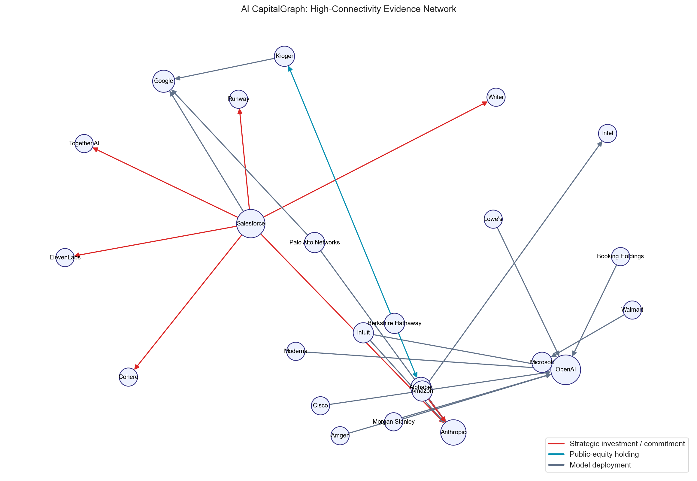

# AI CapitalGraph

## Fortune 500 Investment, Ownership and Strategic-Motive Observatory

AI CapitalGraph is a reproducible research project that connects three questions usually studied in isolation:

1. Which large US companies have publicly documented relationships with GPT, Claude, Copilot, Gemini and adjacent AI platforms?
2. Which companies invest in, commercially support, or own positions in other companies?
3. Which deal structures deserve closer governance review—and what ordinary business explanations could account for them?

The project combines a 500-company financial universe, 39 hand-verified AI relationship records, an SEC Form 13F ownership case study, network analysis, non-parametric association tests and an explainable strategic-anomaly screen. Every substantive relationship links to a named source. The project does **not** infer misconduct from a high anomaly score.



Red edges are strategic investments or commercial commitments, blue edges are reported public-equity holdings, and grey edges are model deployments. The visual shows the 24 highest-connectivity nodes; the machine-readable results retain the complete evidence network.

## Research Snapshot

| Measure | Reproducible output |
|---|---:|
| Fortune 500 universe | 500 companies |
| Documented AI relationships | 39 |
| Deployment/adoption edges | 29 |
| Companies with at least one documented AI edge | 27 |
| SEC ownership edges in the case study | 21 |
| Aggregated disclosed ownership value | $284.3B |
| Disclosed AI transaction value in the register | $29.3B |

These are evidence-register counts, not estimates of universal enterprise adoption. Publicly visible relationships are more likely to be discovered for large and technology-intensive firms.

## What Makes This Different

- **Evidence before inference:** each edge carries its source, date, relationship type and evidence strength.
- **Multiple capital layers:** model adoption, private strategic investment, commercial dependency and public-equity ownership coexist in one graph.
- **Explainable anomaly scoring:** scores decompose into disclosed scale and specific structural flags such as reciprocal cloud spend, control rights, information rights and switching costs.
- **Competing explanations:** every flagged investment includes both a screening hypothesis and a non-suspicious alternative explanation.
- **Real statistical output:** correlations and permutation p-values are generated from committed data with a fixed seed; no placeholder metrics are used.
- **Source-quality controls:** the pipeline validates the 500-company universe and documents a corrected duplicate rank found in the upstream open dataset.

## Main Finding

The evidence supports a two-layer market structure. A small group of cloud/model providers accumulates investment, compute, distribution and information ties, while large operating companies adopt across several competing ecosystems. The strongest review signals are Microsoft–OpenAI, Amazon–Anthropic and Alphabet–Anthropic because their structures combine large disclosed commitments with infrastructure feedback loops or rights discussed by the US Federal Trade Commission. That is a governance finding, not proof of an improper “hidden agenda.” Scale economics, supply assurance and joint product delivery remain credible explanations.

The strongest exploratory association is between company revenue and the presence of documented AI evidence (Spearman rho 0.210; permutation p=0.0002). This result is descriptive and likely affected by disclosure and research-coverage bias.

## Repository Map

```text
data/
  raw/            2024 Fortune 500 universe used for reproducible analysis
  curated/        AI relationships and SEC ownership case study
  sources/        source registry and evidence provenance
figures/          recruiter-ready outputs generated by the pipeline
notebooks/        guided research walkthrough
reports/          findings, methodology and strategic-motive review
results/          company panel, correlations, anomaly scores and network metrics
src/              reusable Python research package
tests/            data-contract and end-to-end tests
```

## Run It

```bash
python3 -m venv .venv
source .venv/bin/activate
python3 -m pip install -r requirements.txt
PYTHONPATH=src python3 -m pytest
PYTHONPATH=src python3 -m aicapitalgraph.cli analyse
```

The analysis rewrites all files in `results/`, the three PNGs in `figures/`, and `reports/generated_findings.md`. CI repeats the full process and fails if committed outputs are stale.

## Reports and Outputs

- [Research report](reports/research_report.md)
- [Strategic motives and unusual investments](reports/strategic_motives_and_unusual_investments.md)
- [Methodology and limitations](reports/methodology.md)
- [Generated findings snapshot](reports/generated_findings.md)
- [Correlation results](results/correlation_results.csv)
- [Explainable anomaly scores](results/strategic_anomaly_scores.csv)
- [Network metrics](results/network_metrics.csv)
- [Company-level evidence panel](results/company_ai_evidence_panel.csv)

## Data Provenance

The company universe is the MIT-licensed 2024 dataset in `evaberezovska/fortune-company-analysis`, which includes rank, revenue, profit, assets, market value, employees and sector. It is used as a stable cross-sectional baseline; AI evidence is dated through 24 September 2026. The official 2026 Fortune page is used only as a top-ranking cross-check because full current ranking data is commercially restricted.

AI evidence prioritises company/provider primary sources. Deal-structure claims use the FTC's Section 6(b) study. Public-equity ownership uses Berkshire Hathaway's Q2 2026 Form 13F. See `data/sources/source_registry.csv` for the complete register.

## Responsible Interpretation

“Hidden agenda” is not an observable variable. This project therefore uses the terms **strategic-motive hypothesis** and **review signal**. Scores prioritise public evidence for human review; they do not identify intent, illegality, causation, beneficial ownership percentage, or competitive harm. Absence from the register means “not documented in this collection,” not “does not use AI.”

## License and Citation

Code is MIT licensed. Third-party data retains its original attribution and licensing. Citation metadata is provided in `CITATION.cff`.

