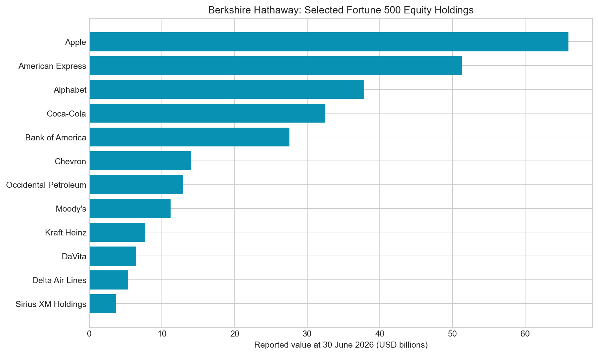
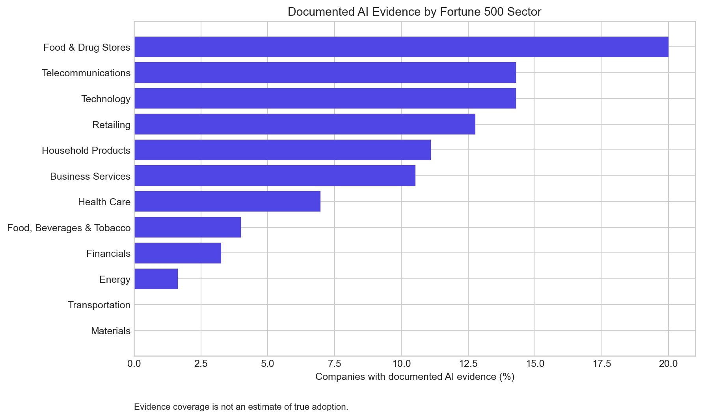

# AI CapitalGraph Research Report

**Evidence cut-off:** 24 September 2026  
**Analytic universe:** 2024 Fortune 500 open-data baseline  
**Research status:** exploratory, reproducible and source-traceable

## Executive Conclusion

Fortune 500 engagement with generative AI is not a single “adoption” story. It is an interconnected capital-and-infrastructure system. The evidence register shows operating companies buying or embedding model services, while a smaller group of cloud and software companies simultaneously invests in model developers, distributes their products, supplies compute, and gains commercial or information rights.

Three relationships stand out for governance review: Microsoft–OpenAI, Amazon–Anthropic and Alphabet–Anthropic. Their prominence is not based on sentiment or media frequency. It comes from disclosed investment scale and structural features described by the Federal Trade Commission, including cloud-spend commitments, switching costs, integration rights and access to business or technical information. The evidence does not establish an improper motive. The same relationships can be rationally explained by the extraordinary capital requirements of frontier-model development and the need for dependable compute and distribution.

## Dataset and Coverage

The company baseline contains 500 firms and financial attributes. The manually verified evidence register contains 39 AI relationships:

- 29 model-deployment or adoption relationships;
- three large equity-and-commercial model partnerships;
- six disclosed Salesforce venture-portfolio relationships; and
- one multi-year AI-chip commercial collaboration.

Twenty-seven universe companies have at least one directly documented AI edge. This 5.4% figure must not be interpreted as an enterprise-adoption estimate. It measures only what this targeted primary-source review documented.

The ownership case study reconstructs 21 Berkshire Hathaway positions in companies that intersect with the large-company universe. The filing reported $284.3 billion in aggregated value across these selected issuers on 30 June 2026. Apple ($66.0B), American Express ($51.3B), Alphabet ($37.8B), Coca-Cola ($32.5B), and Bank of America ($27.5B) are the largest selected positions.

## Examples of Operational AI Adoption

The evidence shows materially different forms of adoption:

- **Morgan Stanley → OpenAI:** GPT-4 supports advisor knowledge retrieval, while Whisper and GPT-4 support meeting summaries. The reported use rate exceeds 98% of advisor teams, but human review remains part of the workflow.
- **Moderna → OpenAI:** ChatGPT Enterprise is deployed across research, legal, manufacturing and commercial functions. The case is strategically important because the system touches regulated life-science work, yet the public evidence also describes validation and human judgement.
- **Walmart → Microsoft:** Azure OpenAI models are combined with Walmart data and retail-specific models. This is a multi-model architecture rather than simple dependence on a single external system.
- **Intuit → OpenAI and Anthropic:** the company appears in two provider ecosystems. That is evidence of model diversification, not automatic vendor lock-in.
- **Palo Alto Networks → Anthropic and Google:** Claude and Gemini/Vertex AI relationships again show that a large company may use multiple layers or providers simultaneously.

These examples matter because a binary “uses AI” label hides differences in deployment depth, data sensitivity, provider concentration and operational dependence.

## Statistical Results

The project compares company scale with whether at least one AI relationship was documented. All four scale variables show small positive rank associations:

| Company characteristic | Spearman rho | Permutation p-value | n |
|---|---:|---:|---:|
| Revenue | 0.210 | 0.0002 | 500 |
| Market capitalisation | 0.205 | 0.0002 | 474 |
| Profit | 0.186 | 0.0002 | 500 |
| Employees | 0.182 | 0.0004 | 500 |

The results are consistent with larger firms having more publicly documented AI relationships. They are not evidence that AI caused scale, that scale caused adoption, or that undocumented companies are non-adopters. Provider marketing pages preferentially feature recognisable customers; large firms also disclose more information. Those mechanisms can generate the observed association.

Sector differences are similarly descriptive. Technology and retail have comparatively high evidence coverage, but small sector denominators and targeted discovery prevent population inference.

## Investment and Strategic-Motive Findings

The explainable screen assigns the highest scores to:

| Relationship | Score | Why it rises in the screen |
|---|---:|---|
| Microsoft → OpenAI | 78.0 | $13.75B reported scale plus cloud-spend, control, information and switching-cost flags |
| Amazon → Anthropic | 65.8 | $13B announced investment plus preferred infrastructure, cloud-spend and switching-cost flags |
| Alphabet → Anthropic | 61.8 | $2.55B reported scale plus cloud-spend, information and switching-cost flags |

The score answers “where should a researcher read the underlying contracts and filings first?” It does not answer “who behaved improperly?”

Salesforce's portfolio produces a different signal. Its individual amounts are undisclosed, while its investments span Anthropic, Cohere, Runway, Together AI, ElevenLabs and Writer. A reasonable strategic hypothesis is **optionality**: maintaining relationships with several technical paths and future integration partners. The equally plausible ordinary explanation is venture diversification and financial return.

## Ownership-Network Interpretation

Berkshire Hathaway is the network's highest-degree node because the case study intentionally includes its 21 selected holdings. OpenAI is the highest-PageRank model node because 14 documented actors point to it. Those statistics have different meanings: degree reflects observed edge count; PageRank reflects incoming position within this constructed evidence network. Neither is a universal measure of corporate power.

An important overlap is Berkshire's reported Alphabet position while Alphabet has its own strategic relationship with Anthropic. This does **not** imply Berkshire influences Anthropic. It illustrates how public-equity ownership and private AI partnerships create multi-hop financial exposure that a flat company list cannot show.

## Final Assessment

The investment pattern is best described as **strategic vertical alignment under high capital intensity**. Model developers need compute and distribution; cloud providers need differentiated model demand; operating companies need productive tools with governance controls. This creates legitimate complementarities and simultaneous concentration risks.

The research conclusion is therefore conditional:

1. reciprocal investment and cloud commitments deserve ongoing competition and governance review;
2. multi-provider adoption is visible and may reduce dependence for some operating companies;
3. disclosure gaps are a research limitation, not evidence of concealment;
4. anomaly scores should trigger source review, not accusations; and
5. causal claims require longitudinal contract, pricing, market-share and performance data beyond this repository.

